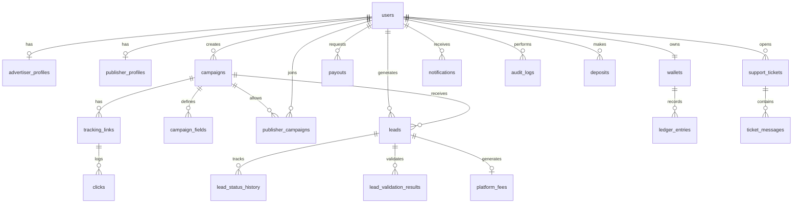

# LeadFlow CPL Platform — Database Schema

**ORM:** Prisma  
**Database:** MySQL 8+

## Offer Management Mapping

In LeadFlow, **Campaigns** serve as **Offers** in the marketplace:

| Business Term | Database Entity | Notes |
|---------------|-----------------|-------|
| Offer | `campaigns` | CPL, budget, category, status |
| Offer fields | `campaign_fields` | Dynamic lead form schema |
| Publisher access | `publisher_campaigns` | Junction: publisher ↔ offer |
| Tracking link | `tracking_links` | Attribution URL per publisher |

---

## ER Diagram



---

## Enums

```prisma
enum UserRole {
  ADMIN
  ADVERTISER
  PUBLISHER
}

enum UserStatus {
  PENDING
  ACTIVE
  SUSPENDED
}

enum CampaignStatus {
  DRAFT
  ACTIVE
  PAUSED
  COMPLETED
  ARCHIVED
}

enum CampaignCategory {
  FINANCE
  INSURANCE
  EDUCATION
  REAL_ESTATE
  GENERIC
}

enum PublisherAccess {
  OPEN
  APPROVAL_REQUIRED
  INVITE_ONLY
}

enum PublisherCampaignStatus {
  PENDING
  APPROVED
  REJECTED
}

enum LeadStatus {
  CAPTURED
  VALIDATING
  PENDING
  APPROVED
  REJECTED
  PAID
}

enum LedgerEntryType {
  CREDIT
  DEBIT
}

enum DepositStatus {
  PENDING
  COMPLETED
  FAILED
}

enum PayoutStatus {
  REQUESTED
  PROCESSING
  COMPLETED
  FAILED
  REJECTED
}

enum PayoutMethod {
  WISE
  BANK_TRANSFER
  STRIPE_CONNECT
}

enum TicketStatus {
  OPEN
  IN_PROGRESS
  WAITING_ON_CUSTOMER
  RESOLVED
  CLOSED
}

enum TicketPriority {
  LOW
  MEDIUM
  HIGH
  URGENT
}

enum TicketCategory {
  BILLING
  TECHNICAL
  CAMPAIGN
  PAYOUT
  OTHER
}

enum KycStatus {
  NOT_SUBMITTED
  PENDING
  APPROVED
  REJECTED
}
```

---

## Core Tables

### users

| Column | Type | Notes |
|--------|------|-------|
| id | String (cuid) | PK |
| email | String | Unique |
| password_hash | String | bcrypt |
| name | String | |
| role | UserRole | |
| status | UserStatus | Default PENDING |
| email_verified | DateTime? | |
| created_at | DateTime | |
| updated_at | DateTime | |

**Indexes:** `email`, `role`, `status`

### advertiser_profiles

| Column | Type | Notes |
|--------|------|-------|
| id | String (cuid) | PK |
| user_id | String | FK → users, unique |
| company | String | |
| industry | String? | |
| billing_info | Json? | |

### publisher_profiles

| Column | Type | Notes |
|--------|------|-------|
| id | String (cuid) | PK |
| user_id | String | FK → users, unique |
| website | String? | |
| traffic_source | String? | |
| kyc_status | KycStatus | Default NOT_SUBMITTED |

### campaigns

| Column | Type | Notes |
|--------|------|-------|
| id | String (cuid) | PK |
| advertiser_id | String | FK → users |
| name | String | |
| description | String? | |
| category | CampaignCategory | |
| cpl | Decimal(10,2) | Cost per lead |
| budget | Decimal(12,2) | Total budget |
| spent | Decimal(12,2) | Default 0 |
| daily_cap | Int? | |
| monthly_cap | Int? | |
| status | CampaignStatus | Default DRAFT |
| publisher_access | PublisherAccess | |
| auto_approve | Boolean | Default false |
| targeting | Json | Countries, states |
| created_at | DateTime | |
| updated_at | DateTime | |

**Indexes:** `advertiser_id`, `status`, `category`

### campaign_fields

| Column | Type | Notes |
|--------|------|-------|
| id | String (cuid) | PK |
| campaign_id | String | FK → campaigns |
| field_name | String | e.g. first_name |
| label | String | Display label |
| field_type | String | text, email, phone, select |
| required | Boolean | |
| validation_rules | Json? | regex, options |
| sort_order | Int | |

### publisher_campaigns

| Column | Type | Notes |
|--------|------|-------|
| id | String (cuid) | PK |
| publisher_id | String | FK → users |
| campaign_id | String | FK → campaigns |
| status | PublisherCampaignStatus | |
| approved_at | DateTime? | |

**Unique:** `[publisher_id, campaign_id]`

### tracking_links

| Column | Type | Notes |
|--------|------|-------|
| id | String (cuid) | PK |
| publisher_id | String | FK → users |
| campaign_id | String | FK → campaigns |
| slug | String | Unique, URL-safe |
| click_count | Int | Default 0 |
| created_at | DateTime | |

**Indexes:** `slug`, `[publisher_id, campaign_id]`

### clicks

| Column | Type | Notes |
|--------|------|-------|
| id | String (cuid) | PK |
| tracking_link_id | String | FK → tracking_links |
| ip | String | |
| user_agent | String? | |
| referrer | String? | |
| geo | Json? | country, city |
| created_at | DateTime | |

**Indexes:** `tracking_link_id`, `created_at`

### leads

| Column | Type | Notes |
|--------|------|-------|
| id | String (cuid) | PK |
| campaign_id | String | FK → campaigns |
| publisher_id | String | FK → users |
| tracking_link_id | String? | FK → tracking_links |
| status | LeadStatus | |
| data | Json | Lead field values |
| score | Int? | 0-100 |
| ip | String? | |
| created_at | DateTime | |
| updated_at | DateTime | |

**Indexes:** `campaign_id`, `publisher_id`, `status`, `created_at`

### lead_status_history

| Column | Type | Notes |
|--------|------|-------|
| id | String (cuid) | PK |
| lead_id | String | FK → leads |
| from_status | LeadStatus? | |
| to_status | LeadStatus | |
| actor_id | String? | FK → users |
| reason | String? | |
| created_at | DateTime | |

### lead_validation_results

| Column | Type | Notes |
|--------|------|-------|
| id | String (cuid) | PK |
| lead_id | String | FK → leads |
| rule | String | e.g. duplicate_email |
| passed | Boolean | |
| details | String? | |

---

## Finance Tables

### wallets

| Column | Type | Notes |
|--------|------|-------|
| id | String (cuid) | PK |
| user_id | String | FK → users, unique |
| balance | Decimal(12,2) | Default 0 |
| hold_balance | Decimal(12,2) | Default 0 |
| currency | String | Default USD |

### ledger_entries

| Column | Type | Notes |
|--------|------|-------|
| id | String (cuid) | PK |
| wallet_id | String | FK → wallets |
| type | LedgerEntryType | CREDIT or DEBIT |
| amount | Decimal(12,2) | |
| balance_after | Decimal(12,2) | |
| reference_type | String | lead, deposit, payout, adjustment |
| reference_id | String? | |
| description | String? | |
| created_at | DateTime | |

**Indexes:** `wallet_id`, `created_at`, `[reference_type, reference_id]`

### deposits

| Column | Type | Notes |
|--------|------|-------|
| id | String (cuid) | PK |
| user_id | String | FK → users |
| amount | Decimal(12,2) | |
| stripe_payment_id | String? | |
| status | DepositStatus | |
| created_at | DateTime | |

### payouts

| Column | Type | Notes |
|--------|------|-------|
| id | String (cuid) | PK |
| publisher_id | String | FK → users |
| amount | Decimal(12,2) | |
| method | PayoutMethod | |
| payment_details | JSON? | Method-specific destination (email or bank fields) |
| status | PayoutStatus | |
| idempotency_key | String? | Unique |
| processed_at | DateTime? | |
| created_at | DateTime | |

### platform_fees

| Column | Type | Notes |
|--------|------|-------|
| id | String (cuid) | PK |
| lead_id | String | FK → leads, unique |
| fee_amount | Decimal(10,2) | |
| fee_percent | Decimal(5,2) | |

---

## Operations Tables

### notifications

| Column | Type | Notes |
|--------|------|-------|
| id | String (cuid) | PK |
| user_id | String | FK → users |
| type | String | lead_approved, payout_completed, etc. |
| title | String | |
| body | String | |
| read_at | DateTime? | |
| created_at | DateTime | |

### support_tickets

| Column | Type | Notes |
|--------|------|-------|
| id | String (cuid) | PK |
| user_id | String | FK → users |
| subject | String | |
| category | TicketCategory | |
| status | TicketStatus | |
| priority | TicketPriority | |
| assigned_to | String? | FK → users |
| created_at | DateTime | |
| updated_at | DateTime | |

### ticket_messages

| Column | Type | Notes |
|--------|------|-------|
| id | String (cuid) | PK |
| ticket_id | String | FK → support_tickets |
| sender_id | String | FK → users |
| body | String | |
| is_internal | Boolean | Admin-only notes |
| attachments | Json? | S3 URLs |
| created_at | DateTime | |

### audit_logs

| Column | Type | Notes |
|--------|------|-------|
| id | String (cuid) | PK |
| actor_id | String | FK → users |
| action | String | e.g. lead.status_changed |
| entity_type | String | |
| entity_id | String | |
| metadata | Json? | |
| created_at | DateTime | |

### platform_settings

| Column | Type | Notes |
|--------|------|-------|
| id | String (cuid) | PK |
| key | String | Unique |
| value | Json | |

**Default keys:** `platform_fee_percent`, `min_payout_amount`, `hold_period_days`, `duplicate_window_days`

### ip_blocklist

| Column | Type | Notes |
|--------|------|-------|
| id | String (cuid) | PK |
| ip | String | Unique |
| reason | String? | |
| created_at | DateTime | |

---

## Future Tables (Phase 2+)

| Table | Phase | Purpose |
|-------|-------|---------|
| landing_pages | 2 | Campaign landing pages |
| page_blocks | 2 | Block JSON per page |
| page_templates | 2 | Pre-built templates |
| email_templates | 2 | Email content |
| drip_sequences | 2 | Automated sequences |
| drip_steps | 2 | Steps in sequence |
| email_sends | 2 | Sent email log |
| email_events | 2 | Open, click, bounce |
| webhooks | 2 | Endpoint config |
| webhook_deliveries | 2 | Delivery attempts |
| affiliate_referrals | 3 | Referral tracking |
| referral_commissions | 3 | Commission ledger |

---

## Index Strategy

- All foreign keys indexed
- `leads`: composite `[campaign_id, status, created_at]` for dashboard queries
- `ledger_entries`: `[wallet_id, created_at DESC]` for transaction history
- `clicks`: `[tracking_link_id, created_at]` for conversion stats
- `notifications`: `[user_id, read_at]` for unread count

---

## Migration Notes

1. Run `prisma migrate dev` for development
2. Seed script creates: admin user, sample advertiser, publisher, campaign
3. Use transactions for all wallet operations (ledger integrity)
4. Soft-delete not used; use status enums instead
