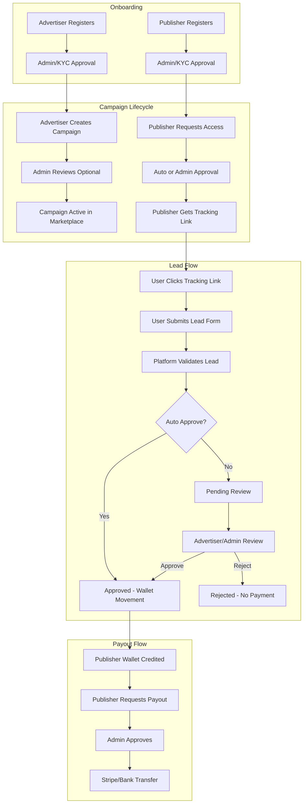
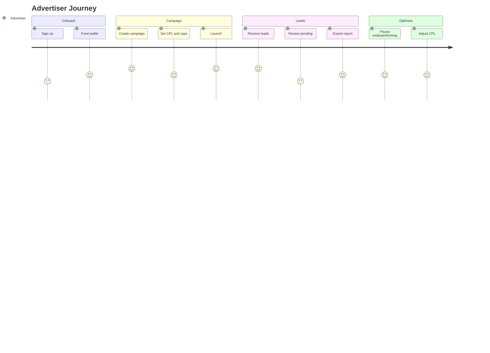
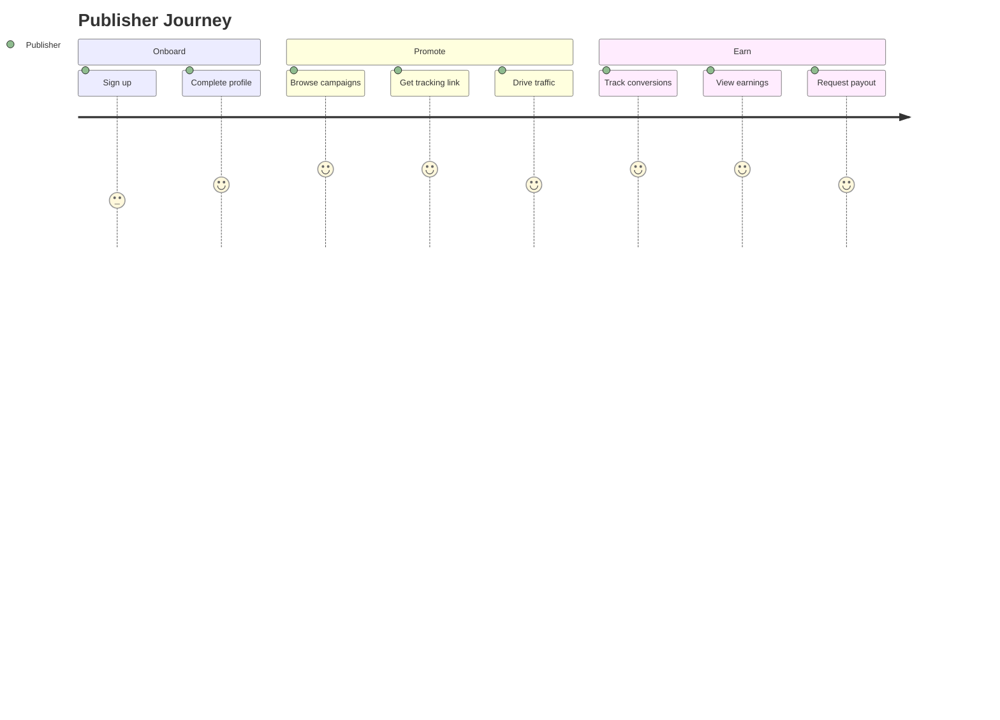
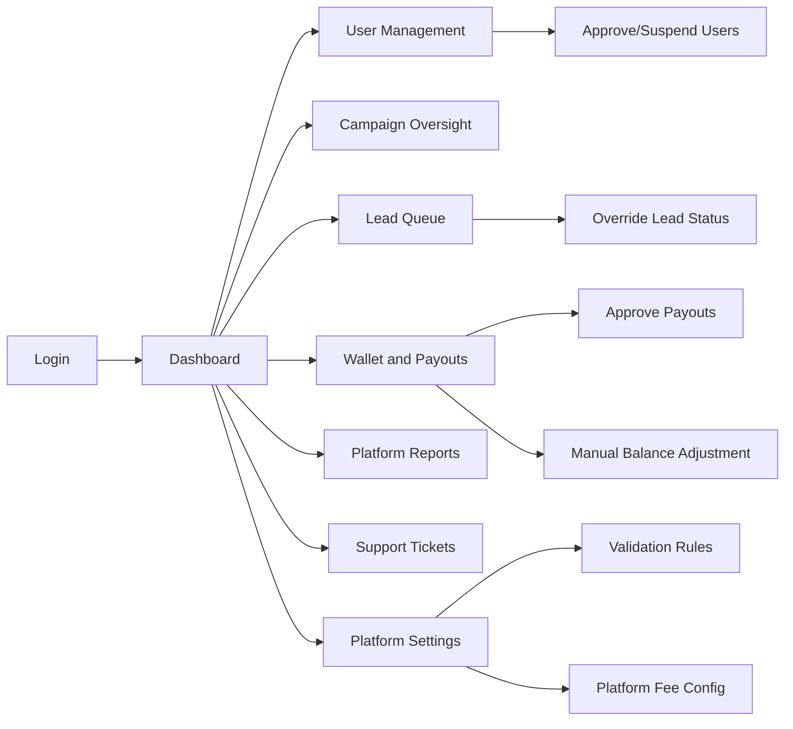
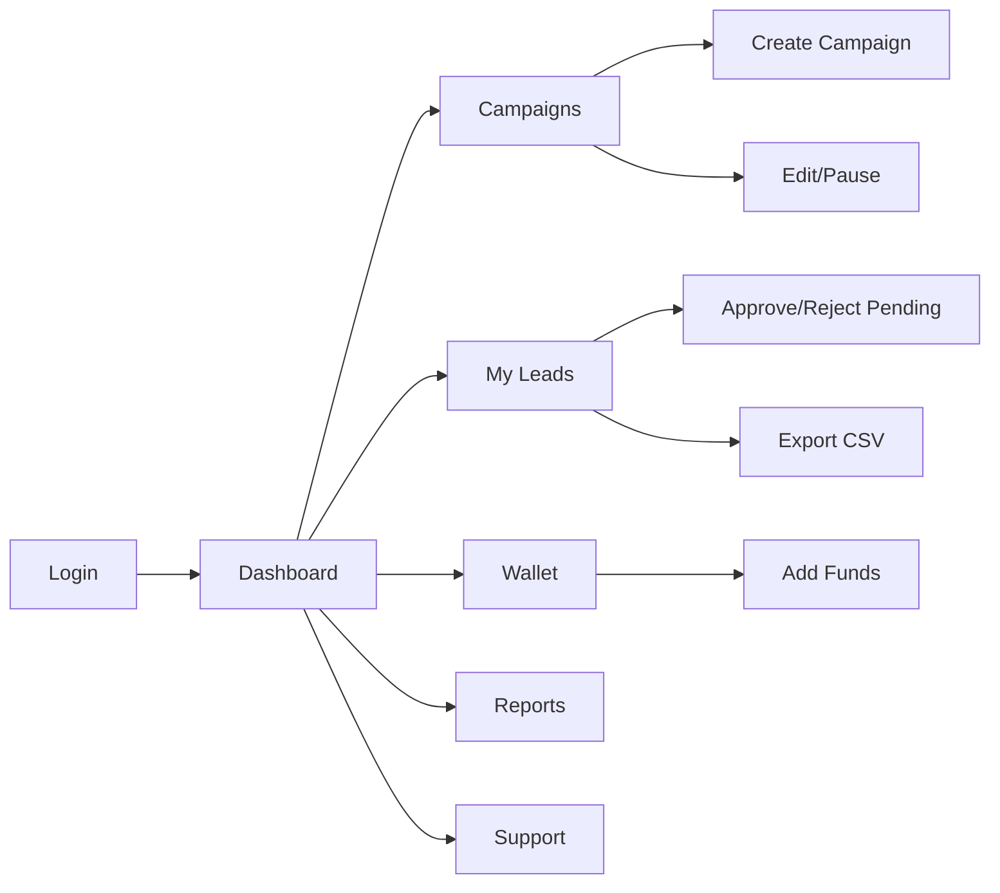
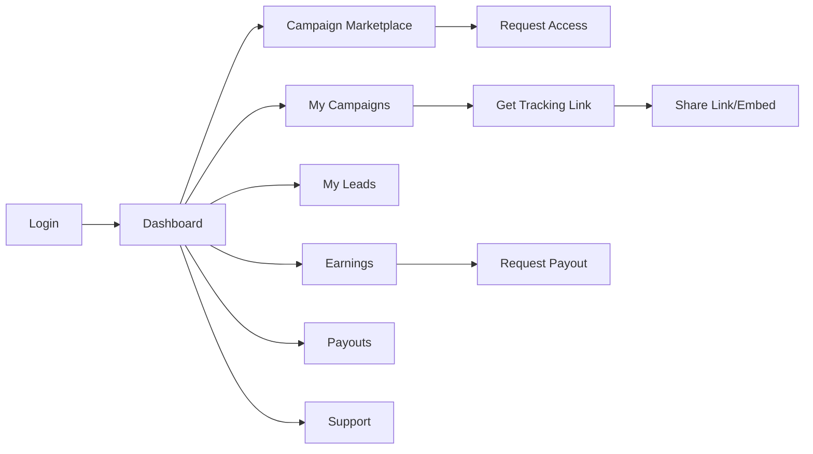
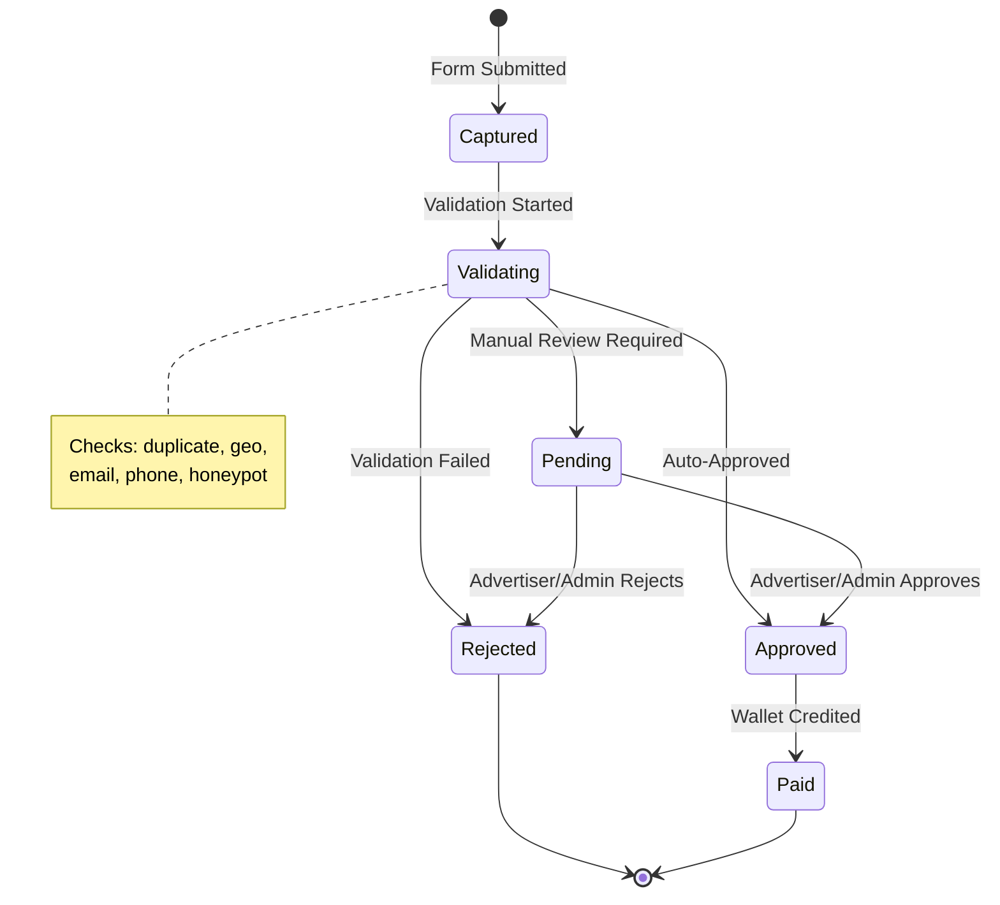

# LeadFlow CPL Platform — Product Requirements Document

**Product Name:** LeadFlow CPL Platform  
**Version:** 2.0  
**Last Updated:** June 2026  
**Status:** Approved for Development

**AI Guardrails:** See [`.cursor/rules/`](../.cursor/rules/) (`cpl-*.mdc`) and [`.cursor/skills/cpl-platform/SKILL.md`](../.cursor/skills/cpl-platform/SKILL.md)

---

## 0. Structured Development Process

| Phase | Focus | Deliverable |
|-------|-------|-------------|
| 1 — Discovery | Business objective, gaps, open questions | This PRD §1–2 |
| 2 — Planning | Docs, guardrails, screen inventory | `docs/`, `.cursor/rules/` |
| 3 — Architecture | Layered app design, VPS model | [DEPLOYMENT.md](./DEPLOYMENT.md) |
| 4 — Database | MySQL entities via Prisma | [DATABASE-SCHEMA.md](./DATABASE-SCHEMA.md) |
| 5 — UI/UX | Design system, navigation, screens | [DESIGN-SYSTEM.md](./DESIGN-SYSTEM.md), [SCREENS.md](./SCREENS.md) |
| 6 — API Design | REST modules, auth, errors | [API-SPEC.md](./API-SPEC.md) |
| 7 — Implementation | Code after plan approval | `src/` (per `cpl-workflow.mdc`) |

**Hosting target:** GoDaddy VPS · MySQL 8+ · Node.js · Nginx · PM2

---

## Table of Contents

1. [Executive Summary](#1-executive-summary)
2. [Problem Statement & Goals](#2-problem-statement--goals)
3. [User Personas](#3-user-personas)
4. [Core Features (MVP)](#4-core-features-mvp)
5. [Functional Requirements by Role](#5-functional-requirements-by-role)
6. [Non-Functional Requirements](#6-non-functional-requirements)
7. [Business Workflow](#7-business-workflow)
8. [User Journeys](#8-user-journeys)
9. [Role Workflows](#9-role-workflows)
10. [Lead Lifecycle](#10-lead-lifecycle)
11. [Navigation Structure](#11-navigation-structure)
12. [Module Breakdown](#12-module-breakdown)
13. [Feature Breakdown](#13-feature-breakdown)
14. [Database Entities](#14-database-entities)
15. [API Modules](#15-api-modules)
16. [Dashboard Widgets](#16-dashboard-widgets)
17. [Landing Page Builder (Phase 2)](#17-landing-page-builder-phase-2)
18. [Email Autoresponder (Phase 2)](#18-email-autoresponder-phase-2)
19. [Reporting Module](#19-reporting-module)
20. [Wallet & Payout Module](#20-wallet--payout-module)
21. [Support Ticket Module](#21-support-ticket-module)
22. [UI/UX Design System](#22-uiux-design-system)
23. [Development Phases](#23-development-phases)
24. [Future Roadmap](#24-future-roadmap)

---

## 1. Executive Summary

**Product Name:** LeadFlow CPL Platform

**Vision:** A premium, enterprise-ready Cost Per Lead marketplace connecting Advertisers (lead buyers) with Publishers (lead generators). The platform validates leads, tracks performance, manages wallets/payouts, and delivers actionable reporting.

**Roles:** Admin · Advertiser · Publisher · Visitor (public lead forms)

**Tech Stack:**
- **Frontend:** Next.js 16 (App Router), React, TypeScript, Tailwind CSS, Shadcn UI, Lucide Icons, Inter font
- **Backend:** Next.js API Routes (Node.js)
- **Database:** MySQL 8+ + Prisma ORM
- **Auth:** NextAuth.js v5 with RBAC
- **Hosting:** GoDaddy VPS (Nginx + PM2)
- **Payments:** Manual/Stripe deposits (VPS MVP); Stripe Connect (future)

**Design Reference:** HubSpot CRM · Stripe Dashboard · GoHighLevel — clean light UI, generous whitespace, data-dense but uncluttered tables, subtle borders, card-based metrics.

---

## 2. Problem Statement & Goals

### Problem Statement

Advertisers need qualified leads at predictable CPL. Publishers need trusted campaigns, transparent tracking, and reliable payouts. Both need fraud protection, real-time reporting, and professional tooling — not spreadsheet-based lead trading.

### Goals

| Goal | Success Metric |
|------|----------------|
| Lead quality | < 5% fraud rate after validation |
| Publisher trust | Payout within SLA (e.g. Net-7) |
| Advertiser ROI | CPL within campaign budget ±10% |
| Platform growth | 50+ active campaigns in 6 months |
| UX quality | Task completion < 3 clicks for core flows |

### Non-Goals (MVP)

- Landing Page Builder (Phase 2)
- Email Autoresponder (Phase 2)
- Affiliate Referral Program (Phase 3)
- Native mobile apps (responsive web only)

### Business Rules

- Lead approved → debit advertiser wallet (CPL), credit publisher wallet (CPL − platform fee)
- Lead rejected → no wallet movement; publisher sees reason
- Campaign pauses when budget exhausted or cap reached
- Publisher payout requires min balance (e.g. $50) and KYC (Phase 1.5)

### Lead Validation Rules (Configurable)

- Email format + MX check (optional)
- Phone format per country
- Duplicate detection (email/phone within campaign, 30-day window)
- Geo-IP vs declared country mismatch flag
- Honeypot + rate limiting on public forms
- Custom regex rules per campaign field

---

## 3. User Personas

**Admin (Platform Operator)**
- Manages users, campaigns, lead rules, payouts, disputes
- Needs system-wide visibility and audit trails

**Advertiser (Lead Buyer)**
- Creates campaigns with CPL budget, caps, geo/targeting
- Reviews leads, exports data, monitors spend

**Publisher (Lead Generator)**
- Browses available campaigns, gets tracking links
- Submits/promotes leads, tracks earnings, requests payouts

---

## 4. Core Features (MVP)

1. **Authentication & RBAC** — Role-based access, email verification (advertisers auto-activate after verify; publishers verify email then await admin approval), 2FA (Phase 1.5)
2. **Campaign Management** — CRUD, status lifecycle, CPL pricing, caps, geo rules
3. **Publisher Assignment** — Auto-approve or admin-approved publisher access per campaign
4. **Tracking Links** — Unique publisher/campaign URLs with click tracking
5. **Lead Capture & Validation** — Form submission, duplicate detection, geo/phone/email validation
6. **Lead Review Workflow** — Auto-approve rules + manual review queue
7. **Wallet & Ledger** — Advertiser deposits, lead debits, publisher credits
8. **Payouts** — Request, admin approval, Stripe/bank transfer
9. **Reporting** — Dashboards, exports (CSV), date-range filters
10. **Notifications** — In-app + email for key events
11. **Support Tickets** — Role-scoped ticket system
12. **Admin Panel** — Full platform oversight

---

## 5. Functional Requirements by Role

### Admin

- CRUD advertisers, publishers, campaigns
- Override lead status, adjust wallet balances (with audit log)
- Configure platform settings (CPL fees, validation rules, payout thresholds)
- View all reports, approve payouts, manage support tickets
- Fraud flags and IP blocklists

### Advertiser

- Create/edit/pause campaigns
- Set CPL, daily/monthly caps, allowed countries, required fields
- View/approve/reject leads for own campaigns
- Fund wallet, view spend reports
- Export leads, open support tickets

### Publisher

- Browse campaign marketplace (approved campaigns only)
- Generate tracking links and embed codes
- View click/lead/conversion stats
- View earnings, request payout (min threshold)
- Open support tickets

---

## 6. Non-Functional Requirements

| Category | Requirement |
|----------|-------------|
| Performance | Dashboard load < 2s; API p95 < 300ms |
| Security | OWASP Top 10, encrypted PII, audit logs |
| Availability | 99.9% uptime target |
| Scalability | 10K leads/day MVP; horizontal API scaling |
| Accessibility | WCAG 2.1 AA for core flows |
| Mobile | Fully responsive; sidebar collapses to drawer |

---

## 7. Business Workflow



---

## 8. User Journeys

### Advertiser Journey



### Publisher Journey



---

## 9. Role Workflows

### Admin Workflow



**Key Admin Screens:** Dashboard · Users · Campaigns · Leads · Wallets · Payouts · Reports · Support · Settings · Audit Log

### Advertiser Workflow



### Publisher Workflow



---

## 10. Lead Lifecycle



**Lead Statuses:** `captured` → `validating` → `pending` | `approved` | `rejected` → `paid` (if approved)

---

## 11. Navigation Structure

### Global Shell

```
┌─────────────────────────────────────────────────────────┐
│ [Logo]  Breadcrumb Trail          [Search] [🔔] [Avatar]│
├──────────┬──────────────────────────────────────────────┤
│ Sidebar  │  Main Content Area                           │
│ Nav      │  Page Header + Actions                       │
│ Items    │  Content (cards, tables, charts)             │
└──────────┴──────────────────────────────────────────────┘
```

### Admin Sidebar

Dashboard · Advertisers · Publishers · Campaigns · Leads · Wallets · Payouts · Reports · Support Tickets · Settings · Audit Log

### Advertiser Sidebar

Dashboard · Campaigns · Leads · Wallet · Reports · Support · Settings

### Publisher Sidebar

Dashboard · Marketplace · My Campaigns · Leads · Earnings · Payouts · Support · Settings

---

## 12. Module Breakdown (15 Core Modules)

| # | Module | Priority | Implementation |
|---|--------|----------|----------------|
| 1 | Authentication | P0 | NextAuth, middleware |
| 2 | User Management | P0 | users, profiles, admin UI |
| 3 | Campaign Management | P0 | campaigns CRUD |
| 4 | Offer Management | P0 | campaigns + marketplace |
| 5 | Lead Forms | P0 | campaign_fields, `/t/[slug]` |
| 6 | Lead Capture | P0 | leads/submit API |
| 7 | Lead Validation | P0 | lead-validation service |
| 8 | Lead Approval | P0 | status workflow |
| 9 | Wallet | P0 | wallets, ledger |
| 10 | Transactions | P0 | ledger_entries, deposits |
| 11 | Withdrawals | P1 | payouts |
| 12 | Reporting | P1 | report service, export |
| 13 | Dashboard | P0 | 3 role dashboards |
| 14 | Notifications | P1 | notifications API + UI |
| 15 | Support Tickets | P1 | support API + UI |

---

## 13. Feature Breakdown

### Campaign Engine

- Campaign CRUD with draft/active/paused/completed/archived states
- CPL pricing (fixed per lead)
- Budget: total cap, daily cap, monthly cap
- Geo targeting (allowed countries/states)
- Required lead fields (configurable schema per campaign)
- Publisher access: open, approval-required, invite-only
- Auto-approve leads toggle + confidence threshold
- Campaign categories (Finance, Insurance, Education, Real Estate, Generic)

### Tracking

- Unique tracking URLs: `/t/{publisherId}/{campaignId}/{hash}`
- Click logging: IP, UA, referrer, timestamp, geo
- Conversion attribution: last-click within 30-day cookie window
- UTM parameter passthrough
- Embed code generator (iframe / JS snippet)

### Leads

- Public lead form (hosted or API POST)
- Status workflow with audit trail
- Bulk approve/reject (advertiser)
- Lead scoring (0–100) based on validation signals
- PII masking in lists (show last 4 of phone)
- Export with field selection

### Wallet

- Double-entry ledger (debit/credit pairs)
- Advertiser: deposit via Stripe, auto-debit on approved lead
- Publisher: credit on approval, hold period (optional)
- Transaction history with filters
- Low-balance alerts

### Payouts

- Min payout threshold
- Payout methods: PayPal, bank transfer, Stripe Connect
- Status: requested → processing → completed / failed
- Admin approval queue
- Payout fee deduction (configurable)

---

## 14. Database Entities

See [DATABASE-SCHEMA.md](./DATABASE-SCHEMA.md) for full Prisma-ready definitions.

### Core Entities

users, advertiser_profiles, publisher_profiles, campaigns, campaign_fields, publisher_campaigns, tracking_links, clicks, leads, lead_status_history, lead_validation_results

### Finance Entities

wallets, ledger_entries, deposits, payouts, platform_fees

### Operations Entities

notifications, support_tickets, ticket_messages, audit_logs, platform_settings, ip_blocklist

---

## 15. API Modules

See [API-SPEC.md](./API-SPEC.md) for full endpoint documentation.

Base: `/api/v1` — JWT auth, role middleware, standardized error envelope.

---

## 16. Dashboard Widgets

### Admin Dashboard

**Cards:** Total Advertisers · Total Publishers · Total Campaigns · Total Leads · Approved Leads · Rejected Leads · Revenue

**Charts:** Leads Trend · Campaign Performance · Top Advertisers · Top Publishers

**Tables:** Recent Leads · Pending Payouts · Open Tickets

### Advertiser Dashboard

**Cards:** Active Campaigns · Total Leads · Approved Leads · Rejected Leads · Cost Per Lead · Total Spend

**Charts:** Leads Over Time · Campaign Performance · Lead Quality

**Tables:** Pending Review Queue · Low Budget Campaigns

### Publisher Dashboard

**Cards:** Clicks · Leads · Approved Leads · Conversion Rate · Earnings

**Charts:** Earnings Trend · Top Campaigns · Lead Status breakdown

**Tables:** Recent Leads · Available High-CPL Campaigns

---

## 17. Landing Page Builder (Phase 2)

- Drag-and-drop block editor
- Blocks stored as JSON in `landing_pages.blocks_json`
- Published at `/p/{campaignSlug}` or custom domain
- Form block auto-wires to campaign lead endpoint

**Block Types:** Hero · Text · Image · Video · Form · Testimonials · CTA

**Templates:** Finance · Insurance · Education · Real Estate · Generic Lead Generation

---

## 18. Email Autoresponder (Phase 2)

- Email Templates with variables (`{{first_name}}`, `{{campaign_name}}`)
- Drip Campaigns triggered on lead capture
- Welcome and follow-up emails (Day 1, 3, 7)
- Open/click rate tracking
- SendGrid / Resend / Amazon SES integration
- CAN-SPAM / GDPR compliance

---

## 19. Reporting Module

| Report | Roles | Filters |
|--------|-------|---------|
| Leads Report | All | date, campaign, status, publisher |
| Campaign Performance | Admin, Advertiser | date, campaign, CPL, ROI |
| Publisher Performance | Admin, Publisher | date, campaign, conversion rate |
| Financial Summary | Admin | date, revenue, payouts, deposits |
| Payout Report | Admin, Publisher | date, status |
| Fraud Report | Admin | date, flagged leads, IP blocks |

Export: CSV, PDF (Phase 1.5). Charts via Recharts. Redis cache for aggregations.

---

## 20. Wallet & Payout Module

### Ledger Design

```
Advertiser deposits $1000 → +1000 advertiser wallet
Lead approved at $5 CPL (10% fee) → -5.00 advertiser, +4.50 publisher, +0.50 platform
(lead status becomes PAID; publisher wallet is credited at payment time, not at approval)
```

Publisher earnings totals and reports use PAID ledger credits. Approved leads may show an estimated payout until payment completes.

### Payout Flow

1. Publisher available balance (balance minus hold) ≥ method minimum
2. Submit payout request — amount is held until admin decision
3. Admin reviews (fraud check, KYC)
4. Approve: debit publisher wallet and release hold; reject: release hold only
5. Process via Stripe Connect / bank transfer / Wise

### Error Handling

| Scenario | Handling |
|----------|----------|
| Insufficient advertiser balance | Campaign auto-pauses; notify advertiser |
| Payout failed | Status → failed; re-credit publisher |
| Duplicate payout request | Idempotency key; reject duplicate |
| Negative balance attempt | Block transaction; log audit |

---

## 21. Support Ticket Module

**Lifecycle:** `open` → `in_progress` → `waiting_on_customer` → `resolved` → `closed`

**Categories:** Billing, Technical, Campaign, Payout, Other

**Features:** Attachments (S3, 10MB), admin assignment, internal notes, email notifications, SLA indicators

---

## 22. UI/UX Design System

See [DESIGN-SYSTEM.md](./DESIGN-SYSTEM.md) for full specifications.

**Stack:** Shadcn UI · Tailwind CSS · Lucide Icons · Inter Font

**Style:** HubSpot CRM · Stripe Dashboard · GoHighLevel inspired — modern, clean, professional, enterprise-ready.

---

## 23. Development Phases

| Phase | Focus | Duration |
|-------|-------|----------|
| 0 | Foundation: scaffold, design tokens, app shell | Week 1–2 |
| 1 | Design & UI prototypes | Week 3–5 |
| 2 | Core backend: auth, campaigns, leads | Week 6–9 |
| 3 | Finance: wallet, payouts | Week 10–12 |
| 4 | Operations: dashboards, notifications, support | Week 13–15 |
| 5 | QA & launch: E2E, security, Sentry | Week 16–17 |
| 6 | Future: LP builder, email, webhooks | Post-MVP |

See [TESTING-STRATEGY.md](./TESTING-STRATEGY.md) for testing requirements per phase.

---

## 24. Future Roadmap

| Quarter | Feature |
|---------|---------|
| Q1 (MVP) | Core platform: campaigns, leads, wallet, payouts, reporting |
| Q2 | Landing Page Builder, Email Autoresponder, Webhooks |
| Q3 | Affiliate Referral, Custom Domains, Advanced Fraud ML |
| Q4 | API Marketplace, White-label, Multi-currency, 2FA + SSO |
